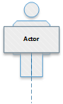

<!-- This file will be linked to from other library files. It is the description file for this effort. (Delete this line.) -->

<!-- The following library navigation line should be the same for all efforts. -->
#### Library Main Navigation: &nbsp; &nbsp;  [Ecosystem Use Case Library Home](https://github.com/NIH-NICHD-Ecosystem) &nbsp; | &nbsp;[User Stories](https://github.com/NIH-NICHD-Ecosystem/UserStories/blob/main/README.md)  &nbsp; | &nbsp; [Use Cases](https://github.com/NIH-NICHD-Ecosystem/UseCases/blob/main/README.md) &nbsp; | &nbsp; [Efforts](https://github.com/NIH-NICHD-Ecosystem/Efforts/blob/main/README.md) &nbsp; | &nbsp; [Library Help](https://github.com/NIH-NICHD-Ecosystem/LibraryHelp/blob/main/README.md)

 

# [Replace next line with "E\<effort-number\>: Effort Name" and delete this line]
# E1: Data Repository Finder 

  
### [A logo or image may appear here, using markdown link syntax as in next line. (Delete this line or entire section if no image.)]

 

### Brief desccription text for the effort goes here.
Other text, if needed
  

## [Keep this section title as is. Delete this line.]
## Effort Overview

 Enter an overview, more detailed than the Brief Description, above.

 

#### [Enter primary contact. It may be a name, phone number, email link, etc. Delete this line.]
#### Primary contact:  [Data-Repository-Finder-Support@ll.mit.edu](mailto:Data-Repository-Finder-Support@ll.mit.edu?subject=Data-Repository-Finder-Support) 
 

#### [Enter the following details. Delete this line and text below in baces.]
#### Details: 
* <b> Built by:</b> [Person or company who built this Effort 
* <b> Hosted by:</b> [Owning/operating site name or URL to the site ]  
* <b> Sponsor contact:</b> [Name, phone number, email link, or other contact method for effort ssponsor ]
  

## [Keep this section title as is. Delete this line.]
## Effort Scope

### [> Effort Documentation](https://github.com/NIH-NICHD-Ecosystem/E1_Data-Repository-Finder/blob/main/Documentation/Use-Cases-Overview.md) 

## [Keep this section title as is. Delete this line.]
### Related Use Cases and User Stories
[A markdown table of Use Cases and UserStories implemented by this Effort. Replace the two example lines with lines for your effort. Delete this line.]
| UC# | Use Case  |  User Story    | 
| :--------|:------------------------------- | :------------------------------- | 
| UC1.1 | [Add repository](https://github.com/NIH-NICHD-Ecosystem/E1_Data-Repository-Finder/blob/main/Documentation/1_Use-Cases/Pages/UC1.1_Add-Repository.md) | <ul><li>(enabling functionality)</li></ul>
| UC1.2 | [Publish repository](https://github.com/NIH-NICHD-Ecosystem/E1_Data-Repository-Finder/blob/main/Documentation/1_Use-Cases/Pages/UC1.2-PublishRepository.md) | <ul><li>(enabling functionality)</li></ul>
